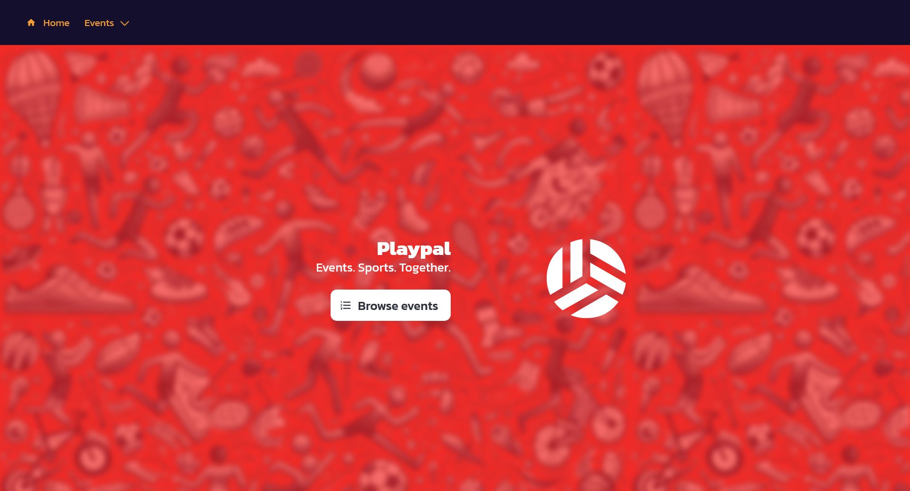
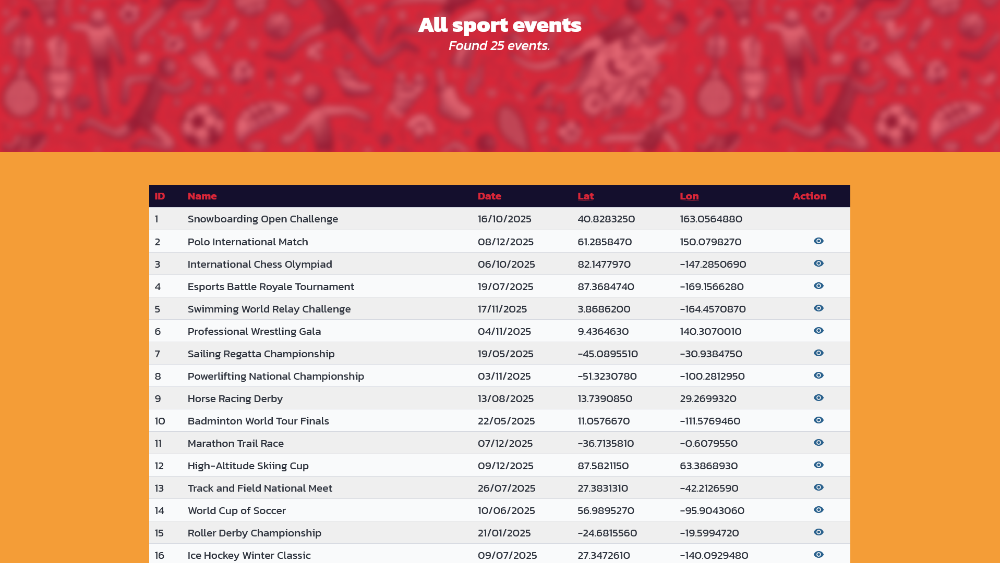
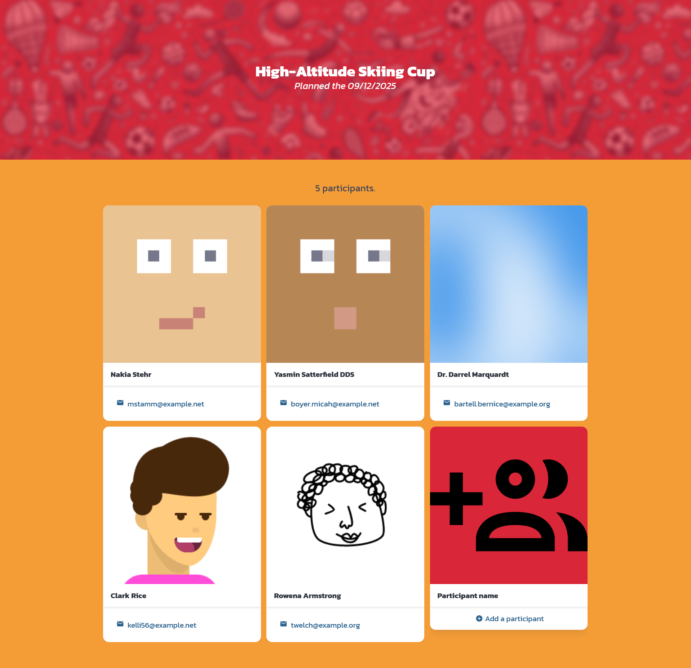
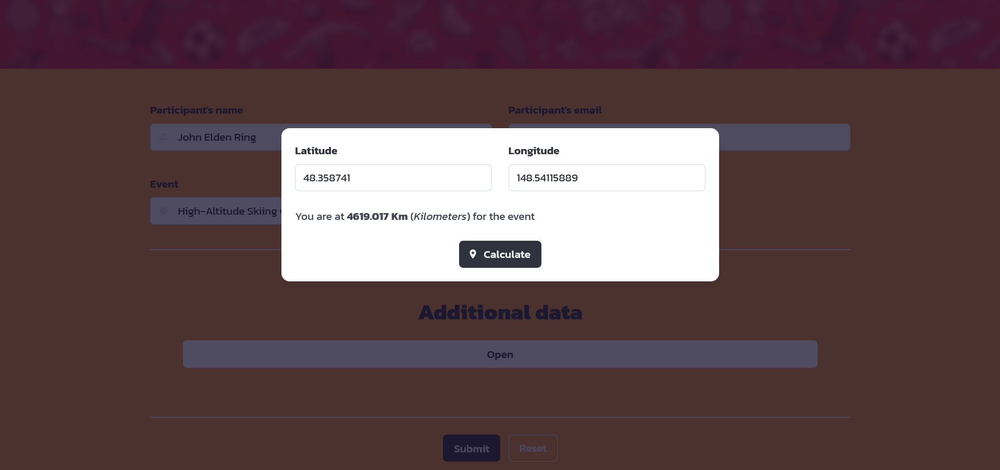

# Playpal
***Playplal*** is a PHP Symfony project centered about sport events.
You can view and create sport events with the possibility to add participants to said events.

## Requirements
- Symfony CLI
- PHP 8.2 or above
- Composer CLI
- NPM

## Quickstart
Before quickstarting, make sure you do not have a DB named "playpal". <br/>

Also, make sure you have an env variable for the database connection URL.
The one used for this project is the following: ``DATABASE_URL="mysql://root:@127.0.0.1:3306/playpal?serverVersion=8.3.0&charset=utf8mb4"``

```shell
# First, install composer dependencies
composer install

# Create the DB and insert fixtures' data inside
symfony console doctrine:database:create --no-interaction
symfony console doctrine:migrations:migrate --no-interaction
symfony console doctrine:fixtures:load --no-interaction

# Install NPM packages and build the assets
npm install
npm run dev

# And serve the project !
symfony serve

```

## Informations
This section groups some informations about how the project has been built.

### Back-end
The Project is mainly written in [PHP](https://www.php.net/) version 8.3.
The framework used in this project in [Symfony](https://symfony.com/) version 7.1. <br/>

This project used the following Symfony packages:
- console
- dotenv
- flex
- form
- twig
- webpack encore
- web profiler (dev only)

Also, the error screen is not Symfony's default error screen but [Spatie's Ignition bundle](https://github.com/spatie/symfony-ignition-bundle).

### UI
The JS and SCSS are built by [Webpack](https://webpack.js.org/). More precisely, [Webpack encore](https://symfony.com/doc/current/frontend/encore/index.html).

For the style of the project, the CSS framework [Bulma CSS](https://bulma.io/) using [SCSS](https://sass-lang.com/) has been used. <br/>
The colors for Bulma that have been used can be found in the file ``/assets/styles/bulma.scss``.

For the icons, the NPM library [Iconify](https://www.npmjs.com/package/iconify-icon) has been used.

Also, some API calls are made inside the project. The library [Axios](https://axios-http.com/docs/intro) has been used to facilitate the calls.

## Gallery
Here are screenshots of playpal:


<hr/>

<hr/>

<hr/>

